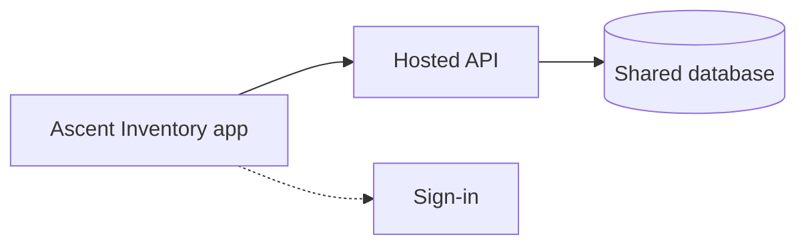

# Ascent Inventory

A desktop inventory app for tracking employees, departments, IT equipment, and lab instruments. Data is shared across authorized users through a central hosted service.

## Overview

- Organize people into departments and sub-departments
- Attach computers and notes to employees
- Track shared/lab equipment and instruments
- Search and browse from a single window
- Sign-in required; role-based access

## Architecture

All users see the same inventory; changes sync through the hosted backend.

## Roles

| Role   | Access                                       |
| ------ | -------------------------------------------- |
| viewer | Browse departments, employees, and inventory |
| admin  | Create, edit, and delete all records         |

## Data model

- **Departments** — top-level with optional sub-departments
- **Employees** — ID, name, department, notes
- **Computers** — employee, shared, or lab assets (models, specs, OS, webcam, phone, notes)
- **Instruments** — lab equipment (model, serial, notes)

## Features

- Department sidebar and sub-departments
- Search employees by ID, name, department, and related fields
- Employee list and detail views
- Computer and instrument inventory per department/lab

## User flows

### Access an employee

1. Start with a search (ID, name, department, etc.) or select a department from the sidebar
2. View members matching the search or selection
3. Open a member to see their profile, assigned computers, and notes

### Add an employee

1. Choose **Add Employee** (admin only)
2. Enter an employee ID — the app checks whether that ID already exists
3. Fill in name, department, and any other details
4. Save to create the record

### Edit or delete an employee

1. Find the employee via search or department browse
2. Open their detail view
3. Edit information or delete the record (admin only)
4. Changes are saved and visible to other users
